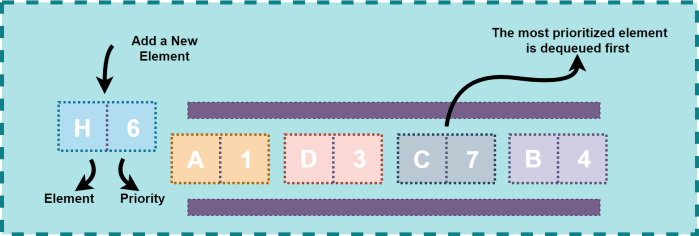

#Java Bootcamp Banka Numerator Uygulaması

Bu ödevde bir bankanın ziyaretçilerini işlem sırasına sokabilmek için kullandığı numara üretici implementasyonu yapılması
beklenmektedir. Ziyaretçiler bankaya geliş sırasına ve bankadaki müşteri olma durumuna göre bir sıraya alınacak ve 
sırası gelen müşteri işlem için memur ile görüşmeye başlayacaktır. Bankaya gelen kişiler 3 gruba ayrılmaktadır ve herbir
ziyaretçinin öncelik durumu sıralamada yerini belirlemelidir.


| Tip | Açıklama | Öncelik |
|------------- | ---------- | --------|
| GUEST |Banka müşterisi olmayan| 1 |
| CUSTOMER |Banka müşterisi | 2 |
| SPECIAL_CUSTOMER |Özel banka müşterisi | 3 |




Bu ödevdedeki teknik beklentiler aşağıdaki gibidir:
* Ödev nesneye yönelik programlama prensipleri göze alınarak geliştirilmelidir
* Queue her tipte veri depolamaya elverişli olacak şekilde jenerik olarak geliştirilmelidir
* Hata durumları göz önünde bulundurulmalıdır
* Queue dinamik olarak veri saklamaya uygun olmalı herhangi bir boyut limiti olmamalıdır. (Bu nedenle veri saklamak için 
  array kullanımı önerilmiyor)
* Queue minimum aşağıdaki metodları sağlamalıdır

      add(value) -> Kuyruğa yeni veri eklemek için
      peek() -> Kuyruktan sıradaki veriyi silmeden okumak için
      poll() -> Kuyruktan veri okumak ve okunan veriyi silmek için
      size() -> Kuyruktaki eleman sayısını görmek için
      printQueue() -> Kuyruktaki elemanları silmeden ekrana bastırmak için

* Ziyaretçiler aşağıdaki formatta bir dosyadan okunacaktır

```text
Visitor Name, Visitor Type
Huseyin Karabakla, GUEST
Fuat Ateş, CUSTOMER
Onur Gür, SPECIAL_CUSTOMER
```

